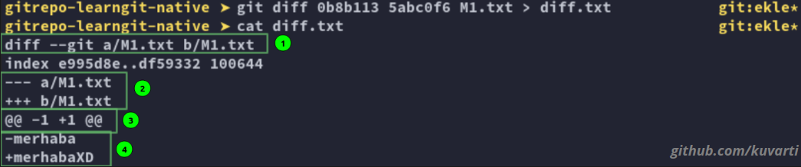

# **GIT**
&nbsp;&nbsp;&nbsp;
Git küçük veya büyük farketmeksizin projeleri hızlı ve etkili şekilde yöneten bir açık kaynak kodlu ücretsiz dağıtılmış kontrol sistemidir.

Bir klasör'ün git tarafından kontrol edilmesini istiyorsak o klasöre gidip;

	git init
yazarak mevcut dizin ve alt dizinleri git kontrolüne alırız. Eğer başarılı olduysak ```ls -a``` yazdığımızda ```.git``` klasörünü görebiliyoruzdur.

## **Kavramlar**

**Repository(Repo):** Repository genel olarak bütün dosyalarımız ve bilgilerinin bulunduğu bir depodur.

**Working Directory:** Çalışma dizini. Repo burada bulunur ve bu alanda çalışırız.

**Staging Area:** Proje dosyalarımızdaki değişiklikleri yeni versiyon olarak eklemeden önce kayıt altında tuttuğumuz alan.

**Commit:** Dosyaları kalıcı olarak repoya işlemeye commit denir.

### **Git Workflow(iş akışı):**


## **Git Config**
git config -> Git yapılandırma ayarları bu komut üzerinden yapılır.
\
&nbsp;
\
&nbsp;
git işlemlerine başlamadan loglarda tutulabilmesi için kullanıcı adı ve mail adresi girilmelidir.

	git config <Parametre> user.name "<isim>"
	git config <Parametre> user.mail "<mail>"
&nbsp;
	Commitler vs.. için mesaj editörü eklemek için;
```
git config <parametre> core.editor "<program>"
```
\
&nbsp;
Mevcut yapılandırmaları görüntülemek için bunlardan birisini yazabiliriz;
```
git config -l
git config --list
```
### Parametreler

  * ### **--global**
	Global(Genel) düzeyde ayarlamalar kullanıcıya özeldir, yani bir işletim sistemi kullanıcısına uygulanır. Global ayarlamalar kullanıcının 'home' dizininde depolanır.

		git config --global ...

  * ### **--system**
	System(Sistem) düzeyinde ayarlamalar tüm makineye uygulanır. Bu işletim sistemindeki bütün kullanıcıları ve bütün repo'ları kapsar. system ayarlamaları makinenin 'root' dizininde depolanır.

		git config --system ...

## **Basics**

&nbsp;&nbsp;&nbsp;
Başlangıç seviyesi için bilinmesi gereken komutlar;
 * **git add** -> Dosyaların Staging Area'ya aktarır.

		git add <dosya> <dosya> ...
 * **git rm** -> Git'e eklenen dosyaları siler.

		git rm <dosya> <dosya> ...
 * **git status** -> Git'e eklenen dosyaların durumunu gösterir.

		git status
 * **git log** -> Git'e eklenen dosyaların commit loglarını gösterir.

		git log
 *	### **.gitignore**
	&nbsp;&nbsp;&nbsp;Klasörün içindeki bazı dosyaları git'in umursamamasını(yok saymasını) istediğimiz zaman gitignore tam aradığımız şey. ```.gitignore``` adında bir dosya oluşturup içine satırlar halinde yoksaymak istediğimiz dosyaları yazabiliriz.
 * ### **git checkout/Reset**
   * **Checkout** -> Git'e eklenen dosyaların durumunu geri alır, branch veya tag değiştirir.
		```
		git checkout <commit/branch>
		```
   * **Reset** -> Eski kommitlere tamamen geri dönmemizi sağlar.
		```
		git reset <parametre> <commit>
		```
		İşimize yarayan 3 tane parametresi var;
		* **--hard** -> Seçtiğimiz commit ve sonraki bütün commitleri tamamen silip dosyalarda yaptığımız değişiklikleri de tamamen geri alır.
		* **--mixed** -> Seçtiğimiz commit ve sonraki bütün commitleri tamamen siler. Dosyalardaki değişiklikler gitmez ancak untracked hale gelirler.
		* **--soft** -> Seçtiğimiz commit ve sonraki bütün commitleri tamamen siler. Değiştirilmiş dosyalar da bozulmadan Git’e eklenmiş hale gelecektir.
 * ### **git commit**
	Staging Area'daki dosyaları commit eder.
	```
	git commit -m "<commit mesajı>"
	```
	* **amend** -> Son commit açıklamasını değiştirir.
		```
		git commit --amend -m "<commit mesajı>"
		```
 *	### **git restore**
	_(Bu özellik hala geliştirilme aşamasında; davranışı değişebilir)_)

	* **Git Restore** -> Localdeki değişiklikleri son commmit'e kadar geri almamızı sağlar.
		```
		git restore <dosya1> <dosya2> <dosyaN>
		```
	* **--staged** -> Staging Area'daki commit edilmemiş dosyaları geri çekmemizi sağlar.
		```
		git restore --staged <dosya1> <dosya2> <dosyaN>
		```
 * ### **Git tag**
	Bulunan commmit'e bit tag oluşturur. _(bu tag versiyon ismi olabilir)_
	* **Lightweight** -> Lightweight tag metadata(herhangi bir açıklama vs..) girmeden kullanılan taglardır.
		```
		git tag <isim>
		```
	* **Annotated** -> Açıklamalı tag luşturmak için kullanılır.
		```
		git tag -a <isim> -m "<açıklama>"
		```
	tagları görüntülemek için;
	```
	git tag
	```
	tagları silmek için
	```
	git tag -d <ismi>
	```

## **Branching**


&nbsp;&nbsp;&nbsp;
**Branch** projeyi dallara ayırmamızı sağlar. Ana projeden bir dal ayırarak eklemek istediğimiz özelliği ana programa zarar vermeden, ayrı bir dalda ekleyip test edip eğer problemsiz çalışıyorsa ana programa sonradan eklememize yardımcı olur.

&nbsp;&nbsp;&nbsp;
**Merge** ise herhangi bir brach'de yaptığımız değişiklikleri master branch'imiz ile birleştirme veya master branch'e entegre etme işlemidir.

&nbsp;&nbsp;&nbsp;
**HEAD** Üzerinde bulunduğunuz branchteki en son alınan commite denir.

* ## Branch

	Mevcut brancleri görmek için;

		git branch -l -a


	Yeni branch eklemek için;

		git branch <isim>

	Branch silmek için;

		git branch -d <isim1> <isim2> <isimN>

	Branchler arası geçiş için;

		git checkout <isim>

* ## Merge

	İlk önce birleştirilecek branch'e gidip daha sonra

		git merge <Branch adı>
	Yazarak birleştirebiliriz. ÖR:

		git merge web
	Yazarak "web" branch'ini o an bulunduğum branch ile birleştirdim.

	Eğer birleştirme işlemi başarısız olursa;

		git merge --abort

	###	Merge Türleri
	*	#### Fast Forward
		
\
&nbsp;&nbsp;&nbsp;
		En yaygın merge türüdür. Git'e eklenen dosyaların commit loglarının aynısını kullanarak birleştirir. Eski kodlarda bir değişiklik olmaz. Geçmişi tek çizgi olarak gösterir.

			git merge <Branch adı>

	*	#### Recursive
		
\
&nbsp;&nbsp;&nbsp;
		Recursice 2 HEAD üzerinde çalışır. Recursive yeniden adlandırma içeren birleştirmeleri algılayabilir ve işleyebilir, ancak algılanan kopyaları kullanamaz. Bir dalı çekme veya birleştirme yaparken varsayılan olarak kullanılır.

			git merge -s recursive <branch1> <branch2>

		 ####	**Fast-Forward vs Recursive**
		| Fast-Forward | vs | Recursive |
		| :---------- | :-: | -----------: |
		| Masterda yeni commit olmaz | | Masterda commit olur |
		| Çizgisel geçmiş | | Commit 2 ebevenyi gösterir |
		| Merge commiti bulunmaz | | Merge commiti bulunur |

	*	#### Ours
		
\
&nbsp;&nbsp;&nbsp;
		Ours 1den fazla branchde çalışır. Merge sonucu çıktısı her zaman mevcut branch'in HEADinkidir. Sadece ortak noktaları merge eder diğer dallardan gelen tüm değişiklikleri yok sayar.

			git merge -s ours <branch1> <branch2> <branchN>

	*	#### Octopus
		
\
&nbsp;&nbsp;&nbsp;
		Octopus 2den fazla branch girildiğinde otomatik devreye girer. Eğer çakışmalar olursa onları düzeltmeyi reddeder, manuel olarak düzeltilmesi gerekir.

			git merge -s octopus <branch1> <branch2> <branchN>
	*	#### Resolve
		
		[resim linki](https://www.geeksforgeeks.org/merge-strategies-in-git/)
\
&nbsp;&nbsp;&nbsp;
		Resolve '3-way merge' algoritmasını kullanarak sadece 2 tane Headi çözer. Çapraz merge belirsizliklerini dikkatlice tespit etmeye çalışır. Genellikle güvenli ve hızlı olarak kabul edilir.

			git merge -s resolve <branch1> <branch2>

	*	#### Subtree
		
\
&nbsp;&nbsp;&nbsp;
		subtree, recursive merge uzantısıdır. A ve Byi Merge etmek istediğinizde;
		 eğer B, A'nın alt ağacına karşılık geliyorsa B, A'nın ağaç yapısını yansıtacak şekilde güncellenir, Bu güncelleme ayrıca A ve B arasında paylaşılan ortak ata ağacına da yapılır.

		 	git merge -s subtree <branchA> <branchB>
*	## **Rebase**
	
\
&nbsp;&nbsp;&nbsp;
	```Git Rebase``` ile ```Git Merge``` benzer işlevleri yapmak için kullanılıyor. Temel olarak 2side bir Branchdeki değişiklikleri diğerine aktarmak için kullanılıyor.
\
&nbsp;&nbsp;&nbsp;
	Merge ile birleştirme yapıldığında loglarda Merge işlemini gösteren bir commit bulunurken, Rebase ile yapıldığında loglarda sanki 2 Branchdeki değişiklikler tek branchde yapılmış gibi gözükür.
	```
	git rebase <branch>
	```
	### **Merge vs Rebase**
	
\
&nbsp;&nbsp;&nbsp;

Git üzerinden branching ağını grafiksel olarak görmek için "git a dog";

```
git log --all --decorate --oneline --graph
```
## **Chery-Pick**
&nbsp;&nbsp;&nbsp;
Bir commiti başka bir branche kopyalamaya yarar.
```
git cherry-pick <commit Hash>
```
## **Conflict**(Çakışma)
&nbsp;&nbsp;&nbsp;
	Conflict'ler _(çakışma (lar))_ Farklı Branchlerde aynı dosyada aynı satırlarda değişiklik yapıldıktan sonra Merge etmeye çalışırken karşımıza çıkar. Bir conflict ile karşılaştığınızda şuna benzer birşey yazar.
```
Auto-merging <File>
CONFLICT (content): Merge conflict in <File>
Automatic merge failed; fix conflicts and then commit the result.
```
&nbsp;
	Burada yapmamız gereken. ```<File>``` ile belirtilen dosyayı açıp conflict durumunu çözmek. problem karşımıza şu şekilde gelicektir.
```c
	printf("merhaba dünya");
```
&nbsp;
	Bu noktada '```<<<<<<< HEAD```' ile '```=======```' arasında kalan kısım, kodun HEAD deki yani bulunduğumuz committeki versiyonu gösterir. '```=======```' ile '```>>>>>>> <branch>```' arasında kalan kısım ise kodların ```<branch>```deki versiyonunu gösterir. İkisinden birini veya ikisini birden seçerek düzenleyip daha sonra commit attığımızda conflict'i çözeriz. Ör olarak Çözülmesi Gereken Konflict'i yukarıdaki örnek olarak referans alırsak;

Sadece ```HEAD```i seçersek;
```c
	printf("merhaba");
```
Sadece ```<Branch>```i seçersek;
```c
	printf("merhaba dünya");
```
İkisini birden seçersek;
```c
	printf("merhaba");
	printf("merhaba dünya");
```
olarak bırakmamız yeterli. Kalan çakışma sonucu alanları da sildikten sonra commitlenmeye hazır. Conflictleri daha rahat çözmek için VS Code gibi text editörler kullanabilirsiniz.


## **Diff**
&nbsp;&nbsp;&nbsp;
Git diff kısaca commitler arası değişiklikleri farklılıkları görmek için kullanılır. Bütün commitfarklılıklarını  veya sadece tek bir dosyadaki farklılıkları görebiriz.

* Commit edilmiş dosyalardaki farkları görmek için.
	```
	git log -p
	```
* Staging area'ya eklenmiş ama commit edilmemiş dosyalardaki farka bakmak için.
	```
	git diff --staged
	```
* Commitler arasındaki farklılıkları görmek için.
	```
	git diff <commit1> <commit2> <commitN>
	```
* Commitler arasındaki belirli dosyaların farklarını görmek için.
	```
	git diff <commit1> <commit2> <commitN> <dosya1> <dosya2> <dosyaN>
	```

### **Format**
Git diff bize sonucu belirli bir formatta verir. Bu format:

Numaralarla hangi bölgenin neyi ifade ettiği aşağıda;
1. Bu bölgede gösterilen, hangi dosyaların karşılaştırıldığıdır.
	>Bu bilginin hemen altında index ile başlayan satırda pratik olarak pek işinize yaramayacak dosya bilgileri yer alır.
2. Hangi kısımların hangi dosyaya ait olduğunu göstermek için kullanılır.
	>Benim örneğimde ```---``` olan yerler a/M1.txt'ye ait, ```+++``` olan yerler ise b/M1.txt'ye ait.
3. Diff 2 dosyanın tamamını değil sadece değişen kısımlarını gösterir. ```@@``` ile başlayan satırlarda 2 dosya arasındaki farkın kaçıncı satırdan başlayıp kaç satır devam ettiğini belirtir.
	>(-) ile gösterilen '-' ile belirtilen dosyayı,(+) ile gösterilen '+' ile belirtilen dosyaya ait bilgilerdir. bizim örneğimizde '-'de yani a/M1.txt'de 1. satırda, '+'da yani b/M1.txt'de 1. satırda değişiklik yapılmıştır. Farklı bir örenek için; ```@@ -5,3 +5,5 @@``` ele alırsak - tarafta 5. satırdan başlayıp 3 satır değişiklik, + tarafta 5. satırdan başlayarak 5 satır değişiklik yapılmıştır.
4. Farklılıkların yer aldığı satırları gösterir.
	>(-) olan kısımlar a/M1.txt'de, (+) olan kısımlar b/M1.txt'de değişiklikleri gösterir.

_**Dipnot**_
>_Bu komut yerine kullanılabilecek [meld](https://meldmerge.org) gibi toollarda mevcut. Meld'i difftool olarak ayarlamak için [tıklayabilirsiniz](https://stackoverflow.com/questions/34119866/setting-up-and-using-meld-as-your-git-difftool-and-mergetool)._

## **Stash**

&nbsp;&nbsp;&nbsp;
Git stash ile üzerinde çalıştığınız ancak henüz commit etmediğiniz değişikliklerin geçici olarak Git tarafından kayıt altına alınmasını ve aktif branch'inizin herhangi bir değişikliğin olmadığı temiz bir duruma getirilmesini sağlarsınız.
```
git stash
```

değişiklikleri geçici depoda tutar. ona default olarak açıklama verilir. Bu genelde son commit'in ismidir. Kendine özgü bir açıklama ile oluşmasını istiyorsak;
```
git stash -m "<mesaj>"
```

Bütün stashleri listelemek için;
```
git stash list
```

Listenin en üstündeki değişikliği depodan geri almak için;
```
git stash pop
```

Değişikliği depodan silmeden çekmek için;
```
git stash apply <stash isim>
```

Herhangi bir değişikliği depodan silmek için;
```
git stash drop <stash isim>
```

# **GIT Server Senkronizasyonu**

&nbsp;&nbsp;&nbsp;
Buraya kadar git'i sadece kendi bilgisayarımızda kullandık, ancak Birden fazla kişi çalışıyorsanız git'i uzak sunucu ile beraber kullanabilirsiniz. Dosyalar uzak bir sunucuda saklanır. Siz bu sunucuya değişikliklerinizi (_commitlerinizi_) İterek (PUSH Request) veya sunucuya başkaları tarafından gönderilen değişiklikleri (_commitleri_) çekerek (PULL Request) kendi bilgisayarınızdaki repository'e yükleyebilirsiniz.
## **Git Clone**
&nbsp;&nbsp;&nbsp;
Git Clone ile uzak sunucudaki repository'i kendi bilgisayarınızda kopyalayabilirsiniz. İlk defa kopyalarken clone kullanılır daha sonra uzak sunucudaki değişiklikleri yapmak için Pull işlemi yeterlidir.
* Uzak sunucuyu koplamak için;
	```
	git clone <URL>
	```
	Sunucudan branchimizi kopyalamak için;
	```
	git clone -b <branch>
	```
* Uzak sunucuyu specifik bir klasörde kopyalamak için;
	```
	git clone <URL> <klasör>
	```
## **Git Remote**
&nbsp;&nbsp;&nbsp;
Git Remote uzak sunucudaki repositoryleri oluşturmanıza, görüntülemenize ve silmenize olanak tanır.

* Bağlantı kurulan Sunucuları görüntülemek için; _(daha ayrıntılı görmek için '-v' eklenebilir)_
	```
	git remote
	```
* Uzak sunucuya bağlanmak için;
	```
	git remote add <remote ismi> <URL>
	```
* Bağlantıyı kaldırmak için;
	```
	git remote rm <remote ismi>
	```
* Bağlantı ismini değiştirmek için;
	```
	git remote rename <eski remote ismi> <yeni remote ismi>
	```

## **Fetch - Pull - Push**<!--bu isim değişecek-->

*	### **Fetch**
	&nbsp;&nbsp;&nbsp;
	Git Fetch uzak sunucudaki değişiklikleri kendi bilgisayarınızda yükler. Gelen değişiklikleri kendimiz elimizle merge ederiz.
	```
	git fetch <remote ismi>
	```
*	### **Pull**
	&nbsp;&nbsp;&nbsp;
	Git Pull = Fetch + Merge diyebiliriz. Değişiklikleri uzak sunucudan çeker ve onu merge eder.
	```
	git pull <remote ismi>
	```
*	### **Push**
	&nbsp;&nbsp;&nbsp;
	Git Push Localdeki değişiklikleri uzak sunucuya gönderir.
	```
	git push <remote ismi>
	```
	Git Tagları Uzak sunucuya göndermek için
	```
	git push <remote> <branch> <tag ismi>
	```
	Git amend işlemi sonrası değişikliği uzak sunucuya göndermek için.
	```
	git push <remote> <branch> --force
	```


\
&nbsp;
## Kaynaklar

* https://qastack.info.tr/programming/2304087/what-is-head-in-git
* https://aliozgur.gitbooks.io/git101/content/branching_dallanma_ve_merging_birlestirme/degisiklikleri_merge_etmek.html
* https://medium.com/nafidurmus/git-ile-dallanma-branching-ve-birleştirme-merging-olayları-da805501cc61
* https://www.mobilhanem.com/git-merge-dallari-birlestirelim/
* https://www.atlassian.com/git/tutorials/using-branches/merge-strategy
* https://www.geeksforgeeks.org/merge-strategies-in-git/
* https://aliozgur.gitbooks.io/git101/content/alistirmalar/Gun_10.html
* https://aliozgur.gitbooks.io/git101/content/ileri_seviye_komutlar_ve_islemler/diff_ile_farklari_incelemek.html
* https://www.git-tower.com/learn/git/commands/git-restore
* https://aliozgur.gitbooks.io/git101/content/branching_dallanma_ve_merging_birlestirme/degisikliklerinizi_gecici_olarak_kaydetmek_-_git_stash.html
* https://www.atlassian.com/git/tutorials/saving-changes/git-stash
* https://www.atlassian.com/git/tutorials/syncing
* https://medium.com/@mustafazahidefe/git-notları-7-git-reset-6fefc9835cbe
