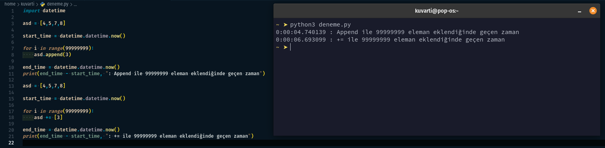

# **PYTHON3**
&nbsp;&nbsp;&nbsp;
Python Nesne Tabanlı, Yorumsal, Modüler ve Etkileşimli, Yüksek seviyeli bir dildir. Python programlama dilini kullanarak; Yapay Zeka, Veri Bilimi, Blockchain, Robotik, Siber Güvenlik, Gümülü Sistem, Web Programlama, Oyun Programlama ve Aklınıza gelebilecek birçok şey yapılabillir.
# **Veri Tipleri**
## **Temel Veri Tipleri**
* ## type()
	objelerin tiplerini gösteren bir gömülü fonkiyondur.
	```Python
	>>> a = 2
	>>> type(a)
	<class 'int'>
	```
* ## Integer
	tamsayı değişkenleri tutar.
	```Python
	>>> a = 2
	>>> type(a)
	<class 'int'>
	```
* ## Float
	ondalık sayı değişkenleri tutar.
	```Python
	>>> a = 2.5
	>>> type(a)
	<class 'float'>
	```
* ## Boolean
	True veya False değişkenleri tutar.
	```Python
	>>> a = True
	>>> type(a)
	<class 'bool'>
	```
* ## String
	karakter dizileri tutar. Stringlerin içeriği immutable (değiştirilemez) olarak tanımlanır. _İndexlenebilirler_
	```Python
	>>> a = "Python"
	>>> type(a)
	<class 'str'>
	```
## **Listeler**
* ## İndexleme
	Liste elemanlarına erişebilmek için indexleri kullanılırız. İndex belirtmek için ```<degisken>[<index>]``` syntaxını kullanırız. Biraz örnek vermek gerekirse;
	```Python
	>>> a = [1,2,3,4,5,6,7,8,9,10]
	>>> a[0]
	1
	>>> a[3]
	4
	>>> a[-1]
	10
	>>> a[-4]
	7
	```
	indexleme yaparken dilimleme yapabiliyoruz. Bu bize belirli bir aralıktaki elemanları almak için kullanılır.
	```Python
	>>> a = [1,2,3,4,5,6,7,8,9,10]
	>>> a[0:3]	# 0. indexten 3. indexe kadar yazar
	[1, 2, 3]
	>>> a[:3]	# 0. indexten veya son indexten bahsederken boş bırakabiliriz.
	[1, 2, 3]	# Python boşluğu bizim için doldurur.
	>>> a[6:]
	[7, 8, 9, 10]
	>>> a[3:6]
	[4, 5, 6]
	```
	```[<başlangıç>:<bitiş>]``` olarak slicing yapabileceğimiz gibi, ```[<başlangıç>:<bitiş>:<adım>]``` formunda da slicing yapabiliriz. Burada adım parametresi kaçar kaçar gideceğimizi belirler.
	```Python
	>>> a = [1,2,3,4,5,6,7,8,9,10]
	>>> a[::2]	# Baştan sona kadar her 2 adımda bir eleman alır.
	[1, 3, 5, 7, 9]
	>>> a[::-1]	# Elemanları sondan başa yazar.
	[10, 9, 8, 7, 6, 5, 4, 3, 2, 1]
	```
* ## len()
	Liste elemanlarının sayısını gösteren bir gömülü fonksiyon.
	```Python
	>>> a = [1,2,3,4,5,6,7,8,9,10]
	>>> len(a)
	10
	```
* ## List
	Listelerde birden fazla elemanı tek isimde tutabiliriz. Elemanlara indexleme yoluyla ulaşırız.

	* **Kullanımı;**
		```Python
		>>> a = [1,2,3,4,5,6,7,8,9,10]
		>>> a
		[1, 2, 3, 4, 5, 6, 7, 8, 9, 10]
		>>> a[3]
		4
		```
	* **Aynı andan birden fazla değişik veri tipi tutabilirler.**
		```Python
		>>> a = [1,2, [1, 2, 3],"Python", True, False]
		>>> a
		[1, 2, [1, 2, 3], 'Python', True, False]
		>>> a[2]
		[1, 2, 3]
		```
	* **Aynı elemandan kaç tane tuttuğunu görmek için**
		```Python
		>>> a = [1,1,2,3,4,5]
		>>> a.count(1)
		2
		>>> a.count(2)
		1
		```
	* **Listelerde elemanların değiştirilmesi mümkündür.**
		```Python
		>>> a = [1,2,3,4,5]
		>>> a[2] = "Python"
		>>> a
		[1, 2, 'Python', 4, 5]
		```
	* **Listelerde elemanların eklenmesi mümkündür. 2 Şekilde yapılabilir.**
		* append()
			```Python
			>>> a = [1,2,3,4,5]
			>>> a.append(6)	# append() fonksiyonu tek ekleme yapılabilir.
			>>> a
			[1, 2, 3, 4, 5, 6]
			>>> a.append([7,8,9])
			>>> a
			[1, 2, 3, 4, 5, 6, [7, 8, 9]]
			```
		* extend()
			```Python
			>>> a = [1,2,3,4,5]
			>>> a.extend([6,7])	# extend() fonksiyonu birden fazla ekleme yapılabilir.
			>>> a
			[1, 2, 3, 4, 5, 6, 7]
			>>> a.extend([[8,9]])
			>>> a
			[1, 2, 3, 4, 5, 6, 7, [8, 9]]
			```
		* El ile ekleme
			```Python
			>>> a = [1,2,3,4,5]
			>>> a += [6,7]
			>>> a
			[1, 2, 3, 4, 5, 6, 7]
			>>> a += [[8, 9]]
			>>> a
			[1, 2, 3, 4, 5, 6, 7, [8, 9]]
			```
		Aynı işi yapsalar bile append() ve extend() fonksiyonları '+=' kullanımına göre yaklaşık 3/2 daha hızlı çalışıyor.
		
	* **Spesifik Bir Indexe Eleman Eklemek.** _Not : Bu Fonksiyon eski indexin üzerine yazmaz, sadece indexi ileri taşır._
		```Python
		>>> a = [1,2,3,4,5]
		>>> a.insert(2, "Python")
		>>> a
		[1, 2, 'Python', 3, 4, 5]
		```
	* **Listeden Eleman Silmek.**
		* Remove()
		\
		Eleman silmek için kullanılır. _Not: Bu Fonksiyon buluğu ilk değeri siler._
			```Python
			>>> a = [1,2,3,4,5,3]
			>>> a.remove(3) # eğer listede 3 yoksa hata verir.
			>>> a
			[1, 2, 4, 5, 3]
			```
		* Pop()
		\
		İndex silmek için kullanılır. _Not: Bu Fonksiyon listeden bir eleman siler ve silinen elemanı döndürür._
			```Python
			>>> a = [1,2,3,4,5,3]
			>>> a.pop(1)	# eğer böyle bir index yoksa hata verir.
			2
			>>> a
			[1, 3, 4, 5, 3]
			>>> a.pop(1) + 1
			4
			>>> a
			[1, 3, 5, 3]
			```
	* **Bir listeyi başkasına kopyalamak.**
	\
	Listeleri direk ```b = a``` şeklinde kopyalayamayız. Eğer bunu yaparsak, eğer a'yı veya b'yi değiştirince 2si birden değişir.
		```Python
		>>> a = [1,2,3,4,5]
		>>> b = a
		>>> a
		[1, 2, 3, 4, 5]
		>>> b
		[1, 2, 3, 4, 5]
		>>> a[0] = "Python"
		>>> a
		['Python', 2, 3, 4, 5]
		>>> b
		['Python', 2, 3, 4, 5]
		```
		Bu yüzden ```copy()``` fonksiyonu kullanılır.
		```Python
		>>> a = [1,2,3,4,5]
		>>> b = a.copy()
		>>> b
		[1, 2, 3, 4, 5]
		>>> a
		[1, 2, 3, 4, 5]
		>>> a[0] = "Python"
		>>> a
		['Python', 2, 3, 4, 5]
		>>> b
		[1, 2, 3, 4, 5]
		```
	* **Listeyi Sıralamak**
		* sort()
		\
		Listeyi sıralamak için kullanılır. _Not: Orjinal listeyi düzenler._
			```Python
			>>> a = [1,5,3,2,4]
			>>> a.sort()
			>>> a
			[1, 2, 3, 4, 5]
			```
		* sorted()
		\
		Listeyi sıralamak için kullanılır. _Not: Orjinal listeyi korumak için kullanılır._
			```Python
			>>> a = [1,5,3,2,4]
			>>> a.sorted()
			[1, 2, 3, 4, 5]
			```

